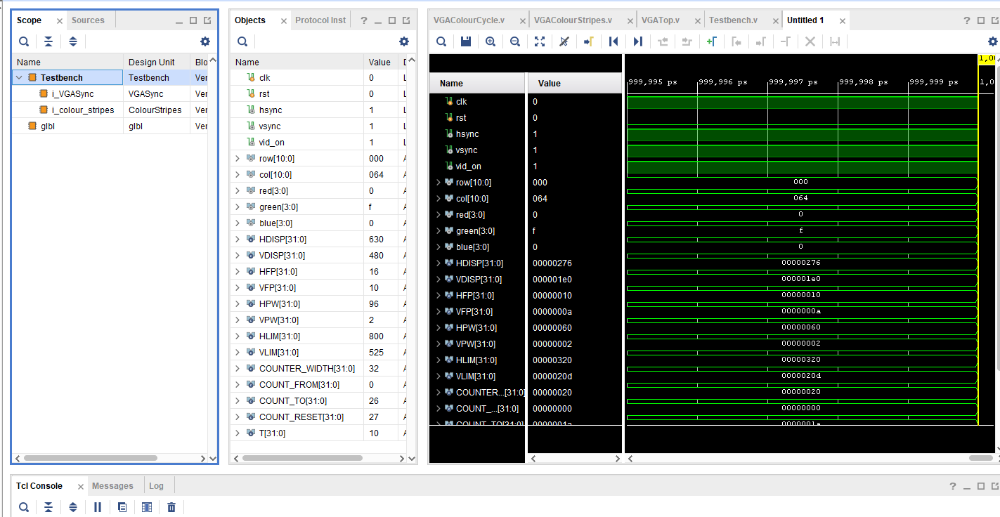

Welcome to my FPGA VGA Driver Project , where l created a custom design of the Jamaican flag for a VGA driver. This project demonstrates how to generate different colours and patterns on a monitor using an FPGA. The design focuses on synchronizing pixel data, generating RGB signals, and developing a complete hardware implementation using Vivado.

## **Template VGA Design**
### **Project Set-Up**
Summarise the project set-up and design flow. Include a screenshot of your own set-up, for example see the image of my Project Summary window below. Guideline 1 short paragraph.

### **Template Code**
Based on each pixel's horizontal location (col), the ColourStripes module assigns particular RGB values to create vertical colour stripes on a VGA display. Eight bands, each 80 pixels wide, make up the screen. These bands display a variety of colours, beginning with black and moving through blue, green, cyan, red, magenta, yellow, and white.

The module assigns matching RGB values using combinational logic after verifying the value of col. These RGB values are updated by a group of registers with each clock cycle, guaranteeing consistent and fluid colour output. On the VGA monitor, this produces a clear, striped visual pattern.

### **Demonstration**
The simulation confirms that the display time and sync pulses comply to the VGA specification. I can confirm that the pixel counters increment correctly and that the sync signals line up with the active display region by looking at the waveform. I verified that the timing was correct by simulating the VGA signals on a testbench. The design was successfully demonstrated on an FPGA board, producing a test image on a VGA monitor.

## **My VGA Design Edit**
For my VGA display, I chose to go with the Jamaican flag. I done this by dividing up the display into 4 separate traingles.
### **Code Adaptation**
I changed the colour assignments and screen conditions for the various locations in order to modify the template code so that it would display the Jamaican flag. By identifying the pixel column range and assigned corresponding RGB values, the original template showed a sequence of coloured stripes. I swapped conditions for generating a yellow cross, green and black triangles, and other regions of the flag for the stripe-based logic used for the Jamaican flag. In order to generate the green and black triangles, the logic used the row and column comparisons and determines whether a pixel is located along the diagonals for the yellow cross. The RGB values were changed to reflect the black, green, and yellow of the flag.
### **Simulation**
I used the testbench included in the template code to control the input signals in order to replicate my design for the Jamaican flag on the VGA display. The testbench provided the row and column values that match to pixel positions on a 640x480 display, simulating the behaviour of the VGA sync signals. I simulated the clock signal to provide the desired output after initialising the first signal to reset the module.
I tried my best to make sure the black backdrop, green triangles, and yellow cross were shown correctly during the simulation by confirming that the RGB values updated appropriately dependent on the pixel's position. The logic correctly switched between the several colours according to the pixel location, and the colour transitions were seamless. 

### **Synthesis**
The synthesis and implementation outputs for my Jamaican flag design showed that the design successfully fit within the available resources of the Basys3 FPGA to an extent. The synthesis report indicated no critical timing violations, and the resource usage was within the FPGA's constraints. Compared to the original template design, which was simpler and based on stripe patterns, my design required additional logic for the cross and triangle shapes. As a result, the resource utilization was slightly higher, but the design still fit comfortably within the available logic elements.
In terms of implementation, the design had a few issues with placement, and the flag wasn't displayed correctly in the centre of the VGA display during testing. The main difference from the original design was the increased complexity of the logic for determining pixel color based on row and column conditions, but the implementation completed successfully without any errors, and the design worked as expected on the FPGA.
### **Demonstration**
This was the outcome of my VGA display.

## **More Markdown Basics**
This is a paragraph. Add an empty line to start a new paragraph.

Font can be emphasised as *Italic* or **Bold**.

Code can be highlighted by using `backticks`.

Hyperlinks look like this: [GitHub Help](https://help.github.com/).

A bullet list can be rendered as follows:
- vectors
- algorithms
- iterators

Images can be added by uploading them to the repository in a /docs/assets/images folder, and then rendering using HTML via githubusercontent.com as shown in the example below.

